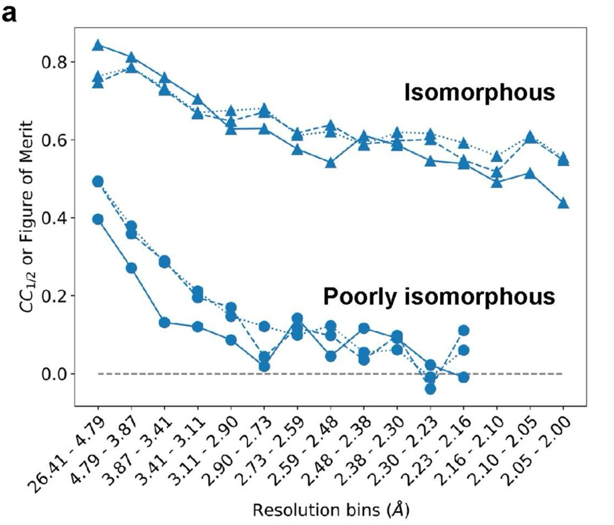

# Should I use `matchmaps`? Diagnosing non-isomorphism

You have two crystallographic datasets that you'd like to compare with an Fo-Fo difference map. Should you use `matchmaps`, or will an isomorphous difference map do the trick? To help answer this question, `matchmaps` provides the utility `matchmaps.diagnose`, which creates a plot similar to the following (Figure 1a from the [MatchMaps paper](https://journals.iucr.org/j/issues/2024/03/00/ei5112/index.html))



## Interpreting this plot

The plot above shows three curves for each pair of datasets; each curve represents a form of resolution-dependent correlation between the datasets.
Two of the curves report $CC_{1/2}$ between structure factor amplitudes and $cos(\textrm{structure factor phases}$), and the third shows the figure of merit for structure factor phases. `matchmaps.diagnose` omits the figure-of-merit caculation and just shows the two $CC_{1/2}$ curves.

The worse the isomorphism between your datasets, the more quickly these correlations will drop off with resolution. The above plot shows two very extreme examples. The isomorphous datasets (PDB IDs 1RX2 and 1RX1) correlate quite well even out to the highest-resolution bin; these datasets can be compared effectively with an isomorphous difference map.

In contrast, the poorly isomorphous datasets (PDB IDs 1RX2 and 1RX4) are much less correlated at low resolution, and their correlation drops off even more quickly with resolution. At even modest resolution, these datasets are essentially uncorrelated. As expected, an isomorphous difference map is entirely useless for comparing these datasets.

### How does your data compare?

If your data looks similar to the "poorly isomorphous" case above, with the correlation dropping to essentially 0, then I definitely recommend trying out `matchmaps`. If your data has some sort of in-between behavior, then it's possible that both an isomorphous difference map and a `matchmaps` difference map could contain useful information. If your data are highly correlated like in the isomorphous case above, I would recommend starting with an isomorphous difference map.

### Phases vs. amplitudes

These plots compare the correlation for both structure factor amplitudes and structure factor phases. In principle, only the phase correlation is consequential for the success of an isomorphous difference map. However, in practice, I suspect that these curves will always overlay closely. If you encounter a situation where the resolution-dependent correlations of amplitudes and phases are significantly different, let me know! I would be very interested to learn more about that.

## Using `matchmaps.diagnose`

```{eval-rst}
.. note::
    Note that, unlike the main `matchmaps` utilities, `matchmaps.diagnose` does *not* require the PHENIX or CCP4 external dependencies. Just a quick `pip install matchmaps`, and you're ready to go!
```
The simplest usage of `matchmaps.diagnose` is to just supply your two input files, along with the names for the structure factor amplitudes and phases in each dataset. Make sure you're including *observed* structure factor amplitudes!

```bash
matchmaps.diagnose \
    --mtzoff off.mtz FP PHIC \
    --mtzon  on.mtz  FP PHIC
```

Make sure that you're supplying phases here! This syntax is similar to that of the main `matchmaps` utilites, except that in those cases, you supply structure factor amplitudes and *uncertainties*.

Full documentation of the command-line interface for `matchmaps.diagnose` can be found on the [CLI page](cli.md#matchmaps-diagnose)
