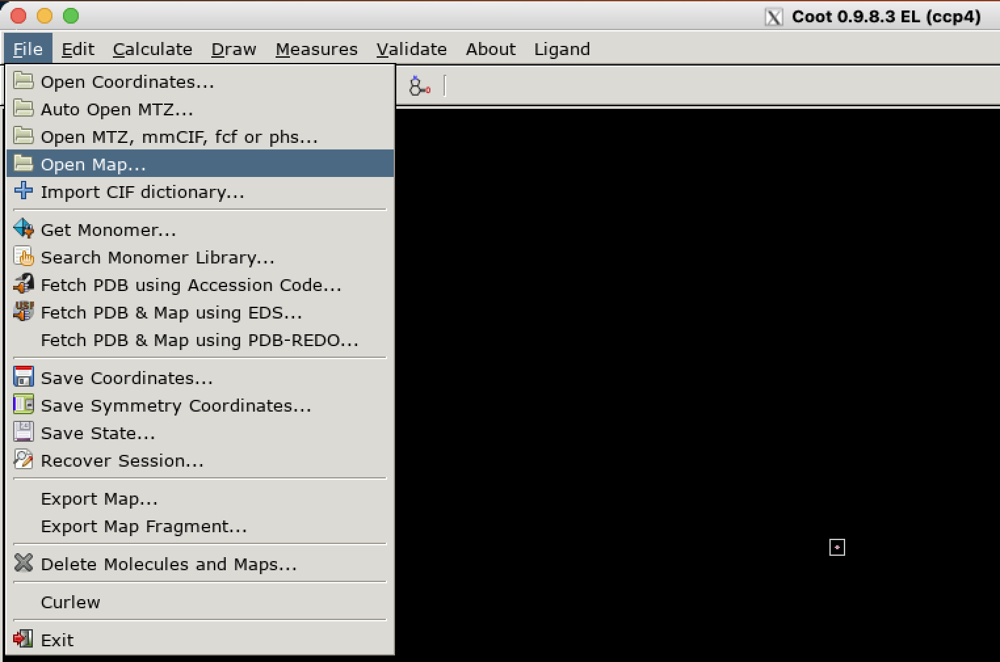

# Visualizing `matchmaps` results
Once you have run `matchmaps`, you'll probably want to visualize the results!

If you have experience with cryo-EM, you're probably familiar with `.map`/`.CCP4`/`.mrc` real-space map files. But if you're a crystallographer, you might not have worked with these at all! Crystallographers typically just open `.mtz` files directly in a software (like coot or PyMOL) that does the Fourier transform and computes the map "on the fly". But here you are, working with `matchmaps`, which by design produces real-space outputs. Below is a brief description of how to work with `.map` files in Coot and PyMOL, along with some quirks specific to `matchmaps` outputs.

## Working with `.map` files in Coot

`.map` files should be opened in Coot via "File > Open Map...":



If the map you are opening is a difference map, it is essential that you check the option "Is Difference Map" in the bottom left corner of the "Select Map..." dialog. If you don't do this here, there is no way to do it later; you'll have to close and reopen the map.


Happy difference mapping! From here, working with a `.map` file should be no different than typical work in Coot with an `.mtz` file.

### Periodic boundary conditions in Coot

`matchmaps` always produces outputs in spacegroup P1, and thus will sometimes produces outputs in P1 and with an orthorhombic unit cell. Unfortunately, Coot assumes that P1 orthorhombic `.map` files are cryo-EM maps, and thus does not render periodic boundary conditions! This is an issue, because often we wish to visualize parts of the protein model which lie outside of the unit cell. As a workaround, any P1 orthorhombic maps produced by `matchmaps` will artifically set `alpha=90.006`. This difference is imperceptible, but is enough to convince Coot that the map is crystallographic in origin. In all likelihood, a user of `matchmaps` will not need to deal with this issue directly. However, it is good to keep in mind in case you are ever working with a `matchmaps` output for another purpose downstream, or if a related bug arises. Of course, if your maps in Coot are ever abruptly ending at the edge of the unit cells, please [file an issue on GitHub](https://github.com/rs-station/matchmaps/issues).

## Working with `.map` files in PyMOL

PyMOL is, for many crystallographers, the preferred software for producing figures. Unfortunately, PyMOL's default behaviors around `.map` inputs can be counterintuitive and hard to work with. I will attempt here to briefly outline the key issues that you might encounter.

Loading a map into PyMOL is easy:
```
load on_minus_off.map, difference_map
```
Then, you will use the `isomesh` command to visualize your map at a given contour, around a given selection:
```
isomesh differencemesh_positive, difference_map, 2, pdb and resi 20
```

### Normalization

`matchmaps` outputs are **already normalized**. This means that when looking at `matchmaps` outputs, the `normalize_ccp4_maps` option should always be set to `off`. If this option is turned on, then the map's contour levels are likely to be very different from, say, how they look in Coot.

### Symmetry expansion.
As mentioned above, `matchmaps` outputs are always in spacegroup P1. This means that the only relevant symmetry operation is the periodic boundary condition. But there is a catch - even though your map is always in P1, your structural model is unlikely to be! PyMOL looks for symmetry operations wherever it can find them. This means that if `map_auto_expand_sym` is on, and you use the `isomesh` command as such:

```
isomesh my_new_mesh, map_from_matchmaps, 2, pdb_in_high_symmetry_spacegroup and resi 20
```

then the map produced will be expanded by a series of nonsense symmetry operators that in no way apply!

There are two potential successful approaches:

 1. If you only wish to visualize density *inside* the unit cell, you're in luck! You can just turn off symmetry expansion (`set map_auto_expand_sym, off`) and this will work just fine.
 2. If the region you would like to visualize does *not* lie inside the unit cell, then you will need to make a copy of your `.pdb` file in which you coerce the spacegroup to P1. (I usually just do this in a text editor; there are many possible approaches to this.) Then, (with `map_auto_expand_sym` set to `on`!) PyMOL should render periodic boundaries as desired, without any spurious symmetry operations.

Hopefully this is useful! If you have any questions about `matchmaps` and PyMOL, please reach out, and I will try to be helpful as best I can!

### [PyMOL Wiki](https://pymolwiki.org/index.php/Main_Page) pages for the commands mentioned

 - [`load`](https://pymolwiki.org/index.php/Load)
 - [`isomesh`](https://pymolwiki.org/index.php/Isomesh)
 - [`normalize_ccp4_maps`](https://pymolwiki.org/index.php/Normalize_ccp4_maps)
 - [`map_auto_expand_sym`](https://pymolwiki.org/index.php/Map_auto_expand_sym)